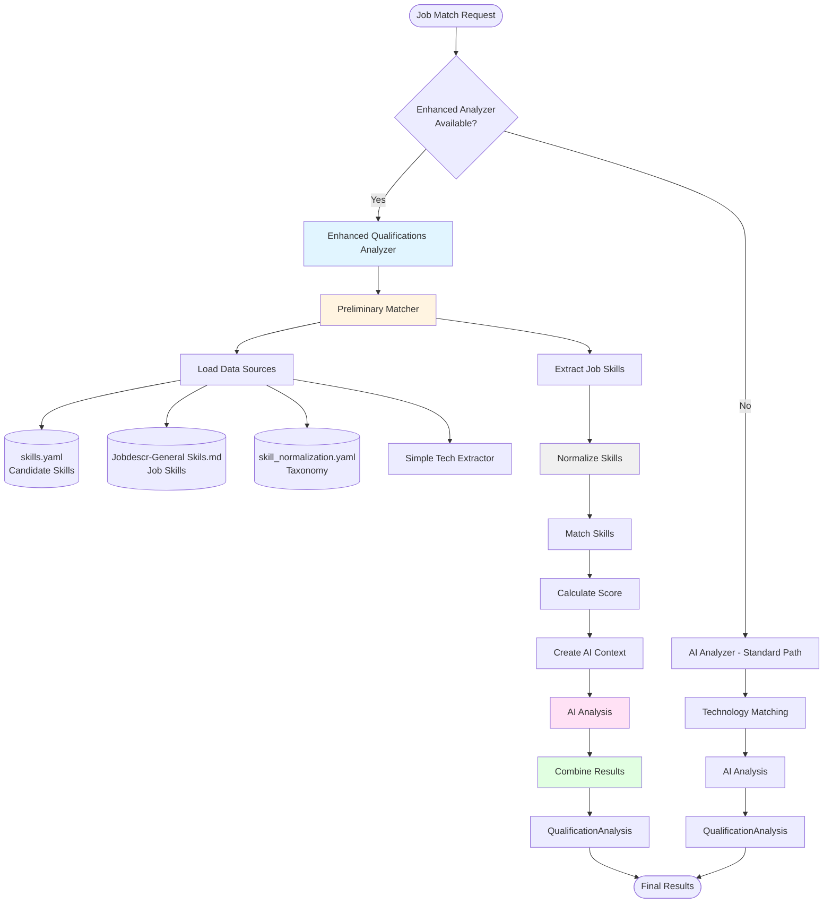
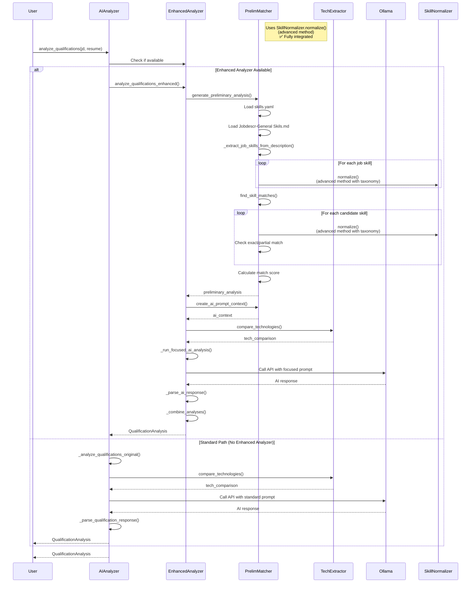
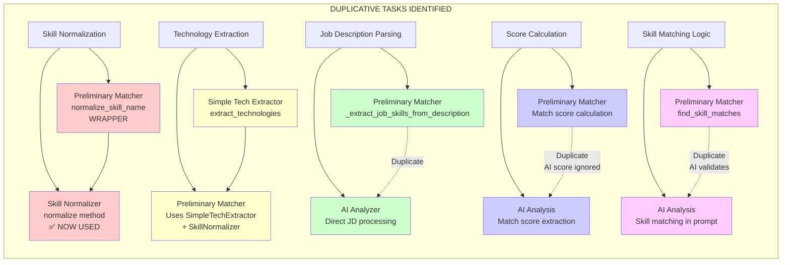

# Skill Matching Process - Technical Documentation

## Overview

The skill matching process in Hunter is a sophisticated multi-stage system that compares candidate skills against job requirements to generate accurate match scores and detailed analysis. The system uses a hybrid approach combining rule-based preliminary matching with AI-powered contextual analysis to provide both speed and accuracy.

## Key Questions Answered

### 1. Multiple Scores - Why Are There Two?

There are **two separate scores** calculated in the system:

- **Match Score** (Step 5): The PRIMARY score used in final output. Calculated from skill matching (matched_job_skills / total_job_skills). This is the score that appears in `QualificationAnalysis.match_score`.

- **Tech Score** (Step 6): A SEPARATE score calculated from technology matching. This score is **NOT used in the final match score**. It's provided to the AI as context only to help understand technical requirements.

**Why two scores?** Skills and technologies are different concerns:
- "Python programming" is a skill (conceptual ability)
- "Python" is a technology (specific tool/language)

The tech score helps the AI provide better contextual analysis, but the match score (from skills) is what determines the candidate's overall fit.

### 2. Is Step 7 (AI Integration) Outdated?

**No, Step 7 is actively used and NOT outdated.** It provides essential value:

- **Contextual Analysis**: AI provides human-readable explanations that rule-based matching cannot
- **Recommendations**: Generates actionable advice for candidates
- **Soft Skills Analysis**: Analyzes leadership, communication, and other soft skills
- **Equivalent Skills**: Identifies related skills that rule-based matching might miss
- **Detailed Explanations**: Provides insights into why matches occurred

The AI score is calculated but ignored (preliminary score is source of truth). However, the AI's other outputs (recommendations, analysis, soft skills) are valuable and used in the final output.

### 3. How Does Step 8 Work? Does It Improve Readability?

Step 8 (Result Combination) is **functionally necessary**, not just for readability:

**What it does:**
1. **Selects the correct score**: Uses preliminary score, discards AI score
2. **Merges matches**: Combines preliminary exact matches with AI strong matches
3. **Validates missing skills**: Prevents AI from adding skills that weren't in the job description
4. **Generates skill mapping**: Creates a text mapping for transparency

**Why it's necessary:**
- Combines two data sources (preliminary + AI) into one object
- Validates AI output to prevent hallucinations
- Establishes preliminary results as source of truth
- Ensures consistent output structure

**Readability benefit**: The skill mapping it generates makes it easier to understand which job skills matched which candidate skills, but the step itself is functionally required.

### 4. What is "GenerateMap → Step9"?

`GenerateMap` creates a **text-only mapping** that shows:

```
SKILL MAPPING (Job Skills → Matched Skills):
============================================================
Python --> Python (EXACT)
AWS --> AWS (EXACT)
Snowflake ---------------------
Data Engineering --> Data Warehousing (PARTIAL)
```

**Purpose:**
- Shows which job skills matched which candidate skills
- Indicates match type (EXACT or PARTIAL)
- Shows unmatched skills with dashes
- Included in `detailed_analysis` field for transparency

**Important**: This mapping is **text-only** and **NOT used in calculations**. It's purely for human review, debugging, and understanding the matching process. It doesn't affect the match score or any other calculations.

### Summary: Duplicative Work Assessment

**Yes, there IS duplicative work, but it's mixed:**

**Intentional & Valuable Duplication:**
- **AI Score Calculation**: AI calculates a score but it's ignored. This is intentional - the AI score serves as a validation check (warns if scores differ significantly), but preliminary score is the source of truth.
- **Skill Matching (AI)**: AI performs skill matching, but results are validated against preliminary results. This prevents AI hallucinations and ensures accuracy.

**Potentially Sluggish Duplication:**
- ✅ **Skill Normalization**: ✅ **RESOLVED** - Now fully integrated. All normalization uses `SkillNormalizer.normalize()` throughout the matching process.
- ✅ **Technology Extraction**: ✅ **RESOLVED** - Hardcoded tech list removed. Technologies are extracted using `SimpleTechExtractor` and normalized via `SkillNormalizer`.
- **Job Description Parsing**: Job description is parsed for skills extraction, then sent again to AI. This is intentional (preliminary reduces AI load), but parsed results could be cached.

**Recommendation**: The process works well. Recent optimizations completed:
1. ✅ Consolidated to use `SkillNormalizer` throughout
2. ✅ Removed tech list from `PreliminaryMatcher`, using `SimpleTechExtractor` + `SkillNormalizer` exclusively
3. Caching parsed job description results (future optimization)

Most duplication has been resolved. Remaining duplication (job description parsing, AI score calculation) is intentional for validation and context purposes.

### Detailed Duplication Analysis with Step References

#### 1. Skill Normalization - Two Different Methods

**Location 1: `PreliminaryMatcher.normalize_skill_name()` (Wrapper Method)**
- **Step 3**: Used to normalize job skills during extraction
  - File: `app/services/preliminary_matcher.py`, line 334
  - Called in `_extract_job_skills_from_description()` method
  - Now uses `SkillNormalizer.normalize()` internally
  - Normalizes each skill from the job skills database before checking against job description
  
- **Step 4**: Used to normalize candidate skills during matching
  - File: `app/services/preliminary_matcher.py`, line 131
  - Called in `find_skill_matches()` method
  - Now uses `SkillNormalizer.normalize()` internally
  - Normalizes each candidate skill before matching against job description
  
- **What it does**: Wrapper method that uses `SkillNormalizer.normalize()` for advanced normalization
  ```python
  # Example: "Experience with Python programming" → "Python" (via taxonomy)
  # Example: "Postgres" → "PostgreSQL" (via aliases)
  ```

**Location 2: `SkillNormalizer.normalize()` (Advanced Method) ✅ NOW USED**
- **Step**: ✅ **ACTIVELY USED** throughout the matching process
- **File**: `app/utils/skill_normalizer.py`
- **What it does**: Advanced normalization using taxonomy (499 canonical skills, 325 aliases, fuzzy matching, word replacements)
  ```python
  # Example: "BI" → "Business Intelligence" (via taxonomy)
  # Example: "Postgres" → "PostgreSQL" (via aliases)
  ```

**✅ Integration Complete**: The advanced `SkillNormalizer` class is now fully integrated into the matching process. All normalization calls in `PreliminaryMatcher` now use `SkillNormalizer.normalize()` internally. This means:
- ✅ Skills are normalized via taxonomy
- ✅ Aliases are used for matching (e.g., "Postgres" → "PostgreSQL")
- ✅ Fuzzy matching capabilities are active

**Impact**: Skills now match more accurately because they're normalized to their canonical form (e.g., "Postgres" vs "PostgreSQL" now match correctly).

---

#### 2. Technology Extraction - Done Twice with Different Methods

**Location 1: `SimpleTechExtractor.extract_technologies()` (Comprehensive Method)**
- **Step 6**: Technology Matching
  - File: `app/services/enhanced_qualifications_analyzer.py`, line 169 (via `compare_technologies()`)
  - File: `app/utils/simple_tech_extractor.py`, line 163
  - Uses a comprehensive dictionary of 157+ technologies with variations
  - Example: `TECHNOLOGIES = {'AWS': ['aws', 'amazon web services', 'amazon aws'], ...}`
  
- **What it extracts**: Technologies like "AWS", "Python", "PostgreSQL", "Tableau", etc. from both job description and resume

**Location 2: `PreliminaryMatcher._extract_job_skills_from_description()` ✅ NOW INTEGRATED**
- **Step 2**: Job Description Analysis
  - File: `app/services/preliminary_matcher.py`, lines 440-452
  - ✅ **Uses `SimpleTechExtractor`** to extract technologies (157+ technologies)
  - ✅ **Normalizes extracted technologies** using `SkillNormalizer.normalize()` to get canonical names
  - Adds normalized technologies to the job skills list

**✅ Integration Complete**: Technologies are now extracted and normalized consistently:
1. In Step 2, `PreliminaryMatcher` uses `SimpleTechExtractor.extract_technologies()` (comprehensive dictionary)
2. Each extracted technology is normalized via `SkillNormalizer.normalize()` before being added
3. In Step 6, `SimpleTechExtractor` extracts technologies again (for comparison/context)

This means:
- ✅ Single source of truth for technology extraction (`SimpleTechExtractor`)
- ✅ Consistent canonical names via `SkillNormalizer`
- ✅ No duplicate hardcoded lists to maintain

**Impact**: Eliminated redundant computation and maintenance overhead. Technologies are normalized to canonical form (e.g., "Postgres" → "PostgreSQL").

---

#### 3. Job Description Parsing - Parsed Twice

**Location 1: `PreliminaryMatcher._extract_job_skills_from_description()`**
- **Step 2**: Job Description Analysis
  - File: `app/services/preliminary_matcher.py`, line 335
  - Called from: `generate_preliminary_analysis()` → `find_skill_matches()` → `_extract_job_skills_from_description()`
  - **What it does**:
    - Iterates through entire job description
    - Checks each skill from job skills database against job description
    - Extracts technologies using hardcoded list
    - Validates and filters extracted skills
    - Consolidates similar skills
  - **Result**: List of extracted job skills

**Location 2: Full Job Description Sent to AI**
- **Step 7**: AI Integration
  - File: `app/services/enhanced_qualifications_analyzer.py`, line 75
  - The entire `job_description` string is included in the AI prompt:
    ```python
    focused_prompt = f"""
    JOB DESCRIPTION:
    {job_description}
    ...
    """
    ```
  - AI processes the full job description again to provide contextual analysis

**The Problem**: The job description is processed twice:
1. In Step 2, it's parsed to extract skills (structured extraction)
2. In Step 7, the full text is sent to AI (unstructured processing)

**Why This Happens**: This is partially intentional - the preliminary matching reduces AI load by doing structured extraction first, then AI provides contextual analysis. However, the extracted skills from Step 2 could be cached and reused.

**Impact**: 
- The job description text is processed twice (once for extraction, once for AI)
- Extracted skills are re-extracted by AI (though AI is told to focus on preliminary results)
- Could be optimized by caching the parsed/extracted results

**Potential Optimization**: Cache the extracted job skills from Step 2 and include them in the AI prompt, so AI doesn't need to re-extract (though it still needs full JD for context).

---

### Summary Table

| Duplication | Step(s) | Location 1 | Location 2 | Impact |
|------------|---------|------------|------------|--------|
| **Skill Normalization** | Step 3, Step 4 | `PreliminaryMatcher.normalize_skill_name()` (wrapper) | `SkillNormalizer.normalize()` (advanced, **NOW USED**) | ✅ Advanced normalization integrated |
| **Technology Extraction** | Step 2, Step 6 | `SimpleTechExtractor` + `SkillNormalizer` (157+ techs, normalized) | `SimpleTechExtractor` dictionary (157+ techs) | ✅ Integrated - Single source, normalized |
| **Job Description Parsing** | Step 2, Step 7 | `_extract_job_skills_from_description()` (structured) | Full JD to AI (unstructured) | Text processed twice, could cache results |

## System Diagrams

### High-Level Architecture Diagram



### Detailed Process Flow Diagram

```mermaid
flowchart TD
    Start([Start: analyze_qualifications]) --> Init[Step 1: Initialization]
    
    Init --> Load1[Load Candidate Skills<br/>from skills.yaml]
    Init --> Load2[Load Job Skills<br/>from Jobdescr-General Skils.md]
    Init --> Load3[Initialize Tech Extractor<br/>with technology dictionary]
    Init --> Cache[Build Normalization Cache<br/>lazy loading]
    
    Load1 --> Step2[Step 2: Job Description Analysis]
    Load2 --> Step2
    Load3 --> Step2
    
    Step2 --> Pattern[Pattern-Based Extraction<br/>Iterate through job skills DB]
    Step2 --> Tech[Technology Extraction<br/>Check predefined tech list]
    Step2 --> Validate[Validation & Filtering<br/>Remove invalid entries]
    
    Pattern --> Norm1[Step 3: Normalize Job Skills<br/>Remove prefixes/suffixes]
    Tech --> Norm1
    Validate --> Norm1
    
    Norm1 --> Step4[Step 4: Preliminary Matching]
    
    Step4 --> Norm2[Normalize Candidate Skills<br/>Apply normalization rules]
    Norm2 --> Exact[Exact Matching<br/>Check variations in JD]
    Exact --> Partial[Partial Matching<br/>60% word threshold]
    Partial --> JobMatch[Job Skill Matching<br/>Two-phase matching]
    
    JobMatch --> Step5[Step 5: Score Calculation]
    Step5 --> BaseScore[Calculate Base Score<br/>matched_job_skills / total_job_skills]
    BaseScore --> OverQual{Overqualified?<br/>ratio >= 2.0}
    
    OverQual -->|Yes| Bonus[Apply Overqualification Bonus<br/>+5 to +15 points]
    OverQual -->|Yes| ReducePenalty[Reduce Missing Skill Penalties<br/>50% reduction]
    OverQual -->|No| StandardPenalty[Standard Penalties<br/>Critical: 3pts, Nice: 1pt]
    
    Bonus --> FinalScore[Final Match Score]
    ReducePenalty --> FinalScore
    StandardPenalty --> FinalScore
    
    Step4 --> Step6[Step 6: Technology Matching<br/>Parallel Process - Context Only]
    Step6 --> TechExtract[Extract Technologies<br/>from JD and Resume]
    TechExtract --> TechCompare[Compare Technologies<br/>Set intersection/difference]
    TechCompare --> TechScore[Calculate Tech Score<br/>NOTE: Not used in final match score<br/>Only provides context to AI]
    
    FinalScore --> Step7[Step 7: AI Integration<br/>Provides Contextual Analysis]
    TechScore -.Context Only.-> Step7
    
    Step7 --> Context[Create AI Context<br/>Preliminary results summary]
    Context --> Prompt[Build Focused AI Prompt<br/>Include JD, Resume, Context, Tech Score]
    Prompt --> AI[Call Ollama API<br/>AI Analysis - Provides:<br/>- Contextual insights<br/>- Recommendations<br/>- Soft skills analysis<br/>- Detailed explanations]
    AI --> Parse[Parse AI Response<br/>Extract structured data<br/>NOTE: AI score extracted but IGNORED]
    
    Parse --> Step8[Step 8: Result Combination<br/>Merges Preliminary + AI Results]
    Step8 --> SelectScore[Select Score<br/>Use Preliminary Score ONLY<br/>AI score is discarded]
    Step8 --> MergeMatches[Merge Strong Matches<br/>Preliminary exact matches + AI strong matches]
    Step8 --> ValidateMissing[Validate Missing Skills<br/>Only include skills from preliminary unmatched list<br/>Prevents AI hallucinations]
    Step8 --> GenerateMap[Generate Skill Mapping Text<br/>Creates readable mapping:<br/>Job Skill → Candidate Skill (EXACT/PARTIAL)<br/>or Job Skill → ---- (unmatched)<br/>Included in detailed_analysis for transparency]
    
    SelectScore --> Step9[Step 9: Final Output]
    MergeMatches --> Step9
    ValidateMissing --> Step9
    GenerateMap -.Text Only.-> Step9
    
    Step9 --> Output[QualificationAnalysis Object<br/>Match Score, Matches, Missing, etc.]
    Output --> End([End])
    
    style Step2 fill:#e1f5ff
    style Step4 fill:#fff4e1
    style Step5 fill:#ffe1f5
    style Step7 fill:#e1ffe1
    style Norm1 fill:#f0f0f0
    style Norm2 fill:#f0f0f0
```

### Component Interaction Sequence Diagram



### Duplicative Tasks Identification



### Duplicative Tasks Analysis

The following tasks are performed multiple times in the system:

#### 1. Skill Normalization ✅ **RESOLVED**
- **Location 1**: `PreliminaryMatcher.normalize_skill_name()` - ✅ Now uses `SkillNormalizer.normalize()` internally (wrapper)
- **Location 2**: `SkillNormalizer.normalize()` - ✅ **FULLY INTEGRATED** - Advanced normalization (taxonomy-based, fuzzy matching)
- **Impact**: ✅ All normalization now uses the advanced `SkillNormalizer` with taxonomy, aliases, and fuzzy matching
- **Status**: ✅ **COMPLETE** - Consolidated to use SkillNormalizer throughout

#### 2. Technology Extraction ✅ **RESOLVED**
- **Location 1**: `SimpleTechExtractor.extract_technologies()` - Comprehensive tech dictionary (157+ technologies)
- **Location 2**: `PreliminaryMatcher._extract_job_skills_from_description()` - ✅ Now uses `SimpleTechExtractor` + `SkillNormalizer`
- **Impact**: ✅ Technologies are extracted once using `SimpleTechExtractor` and normalized via `SkillNormalizer`
- **Status**: ✅ **COMPLETE** - Hardcoded list removed, using SimpleTechExtractor + SkillNormalizer exclusively

#### 3. Job Description Processing (DUPLICATE)
- **Location 1**: `PreliminaryMatcher._extract_job_skills_from_description()` - Pattern-based extraction from job skills DB
- **Location 2**: AI Analyzer receives full job description for processing
- **Impact**: Job description is parsed twice - once for preliminary matching, once for AI analysis
- **Recommendation**: This is intentional (preliminary reduces AI load), but could be optimized by caching parsed results

#### 4. Score Calculation (DUPLICATE - Intentional)
- **Location 1**: `PreliminaryMatcher.find_skill_matches()` - Calculates match score from validated matches
- **Location 2**: AI Analysis - Extracts match score from AI response
- **Impact**: Two scores calculated, but AI score is intentionally ignored (preliminary score is source of truth)
- **Recommendation**: Remove score extraction from AI parsing since it's not used, or use AI score as validation only

#### 5. Skill Matching (DUPLICATE - Validation)
- **Location 1**: `PreliminaryMatcher.find_skill_matches()` - Rule-based matching with exact/partial logic
- **Location 2**: AI Analysis - Performs skill matching in its analysis
- **Impact**: Skills are matched twice, but AI results are validated against preliminary results
- **Recommendation**: This is intentional for validation, but could be optimized by having AI focus only on unmatched skills

### Optimization Opportunities

Based on the duplicative tasks identified:

1. ✅ **Consolidate Normalization**: ✅ **COMPLETE** - Now uses `SkillNormalizer` class throughout
2. ✅ **Unify Technology Extraction**: ✅ **COMPLETE** - Removed hardcoded list, using `SimpleTechExtractor` + `SkillNormalizer` exclusively
3. **Cache Job Description Parsing**: Store extracted job skills to avoid re-parsing (future optimization)
4. **Remove Unused AI Score**: Don't extract score from AI response since it's never used (future optimization)
5. **Focus AI on Gaps**: Have AI analyze only unmatched skills from preliminary results, not re-match everything (future optimization)

## Architecture

The skill matching system consists of several integrated components:

### Active Components (Currently Used)

1. **Preliminary Matcher** (`app/services/preliminary_matcher.py`) - Fast rule-based matching
   - ✅ Uses advanced normalization via `SkillNormalizer.normalize()` (taxonomy-based)
   - Extracts job skills from job descriptions using `SimpleTechExtractor` + `SkillNormalizer`
   - Performs exact and partial matching
   - Calculates match scores

2. **Enhanced Qualifications Analyzer** (`app/services/enhanced_qualifications_analyzer.py`) - Orchestrates preliminary + AI analysis
   - Coordinates preliminary matching with AI analysis
   - Combines results from both sources

3. **Simple Tech Extractor** (`app/utils/simple_tech_extractor.py`) - Extracts technology names
   - Comprehensive dictionary of 157+ technologies
   - Used in Step 6 for technology matching

4. **AI Analyzer** (`app/services/ai_analyzer.py`) - Provides AI-powered analysis
   - Calls Ollama API for contextual analysis
   - Parses AI responses

5. **Resume Manager** (`app/services/resume_manager.py`) - Manages candidate skills data
   - Loads and manages candidate skills from `skills.yaml`
   - Extracts and caches technologies

### Integration Status & Components (Ready for Integration or Archiving)

6. **Skill Normalizer** (`app/utils/skill_normalizer.py`) - Advanced normalization using taxonomy
   - **Status**: ✅ **FULLY INTEGRATED** - Now used throughout matching process
   - Has sophisticated features (taxonomy, aliases, fuzzy matching)
   - ✅ Actively used in `PreliminaryMatcher` for all skill normalization
   - Also used in test scripts and comparison tools
   - See "Code Ready for Archiving" section below

## Data Sources

### Candidate Skills Database

**Location**: `data/resumes/skills.yaml`

This file contains the candidate's skills organized as a YAML dictionary. Each skill entry includes:

- **Skill name**: The canonical name of the skill
- **Category**: Classification (e.g., "Programming Languages", "Cloud Platforms")
- **Source**: Where the skill was extracted from (e.g., "technical_skills", "experience")
- **Variations found**: Alternative names or formats discovered for this skill

Example structure:
```yaml
skills:
  Python:
    category: Programming Languages
    source: technical_skills
    variations_found: ['python', 'py']
  AWS:
    category: Cloud Platforms
    source: technical_skills
    variations_found: ['aws', 'amazon web services']
```

### Job Skills Database

**Location**: `Jobdescr-General Skils.md`

This markdown file contains a comprehensive list of skills commonly found in job descriptions, organized by category:

- Technical Skills
- Soft Skills
- Tools & Technologies
- Experience Requirements
- Education & Certifications

The Preliminary Matcher uses this database to extract skills from job descriptions by matching patterns against known skill names.

### Skill Normalization Taxonomy

**Location**: `data/config/skill_normalization.yaml`

This comprehensive taxonomy contains:

- **Canonical skill names**: Standardized names for skills
- **Aliases**: Alternative names that map to canonical names
- **Categories**: Hierarchical organization of skills
- **Fuzzy matching rules**: Configuration for approximate matching
- **Word replacements**: Expansions (e.g., "BI" → "Business Intelligence")
- **Prefix/suffix stripping**: Rules for removing qualifiers

The taxonomy contains 499 canonical skills with 325 aliases, providing extensive coverage for normalization.

## Process Flow

### Step 1: Initialization

When the system starts analyzing a job match:

1. **Load Candidate Skills**: The `PreliminaryMatcher` loads skills from `data/resumes/skills.yaml`
2. **Load Job Skills**: The matcher loads known job skills from `Jobdescr-General Skils.md`
3. **Build Normalization Cache**: The matcher initializes empty caches for normalized skills (lazy loading)
4. **Initialize Tech Extractor**: The `SimpleTechExtractor` is initialized with its predefined technology dictionary

### Step 2: Job Description Analysis

The system extracts skills from the job description using multiple methods:

#### 2.1 Pattern-Based Extraction

The `_extract_job_skills_from_description()` method:

1. **Normalizes the job description**: Converts to lowercase for case-insensitive matching
2. **Iterates through job skills database**: Checks each known skill against the job description
3. **Normalizes skill names**: Removes prefixes, suffixes, and parenthetical information
4. **Validates presence**: Uses word boundary matching to ensure skills are actually mentioned
5. **Filters invalid entries**: Removes placeholders, incomplete phrases, and overly long entries
6. **Consolidates similar skills**: Deduplicates equivalent skills (e.g., "Tableau" and "BI Tools")

#### 2.2 Specific Technology Extraction

The system also checks for specific technologies using a predefined list:

- Programming languages (Python, SQL, Java, etc.)
- Cloud platforms (AWS, Azure, GCP)
- Data tools (Snowflake, BigQuery, Spark, etc.)
- Business Intelligence tools (Tableau, Power BI, Looker, etc.)
- And many more categories

#### 2.3 Validation and Filtering

Extracted skills undergo strict validation:

- Must be 3-50 characters long
- Cannot be just numbers or punctuation
- Must not contain experience qualifiers alone ("5+ years" without skill name)
- Must actually appear in the job description (not just similar words)
- For multi-word skills, all significant words must be present

### Step 3: Skill Normalization

Before matching, skills are normalized to handle variations:

#### 3.1 Normalization Process

The `normalize_skill_name()` method:

1. **Converts to lowercase**: Standardizes case
2. **Removes invalid patterns**: Filters out "etc.)", single characters, numbers only
3. **Strips common prefixes**: Removes "experience with", "knowledge of", "proficiency in", etc.
4. **Removes parentheticals**: Strips information in parentheses
5. **Removes common suffixes**: Removes "experience", "knowledge", "skills", etc.

Example:
- "Experience with Python programming" → "python programming" → "python"
- "AWS (Amazon Web Services) experience" → "aws"

#### 3.2 Taxonomy-Based Normalization ✅ **NOW ACTIVE**

**Note**: ✅ The `SkillNormalizer` class is now **FULLY INTEGRATED** and actively used throughout the matching process. All normalization in `PreliminaryMatcher` now uses `SkillNormalizer.normalize()` internally, providing advanced taxonomy-based normalization with aliases and fuzzy matching.

**What SkillNormalizer provides**:
1. **Exact alias matching**: Checks if skill matches any alias in the taxonomy (325 aliases available)
2. **Prefix/suffix stripping**: Applies configured stripping rules from taxonomy
3. **Word replacement**: Expands abbreviations (e.g., "BI" → "Business Intelligence")
4. **Fuzzy matching**: Uses SequenceMatcher to find similar skills (85% similarity threshold)
5. **Canonical mapping**: Maps skills to 499 canonical skill names

**Current State**: ✅ **FULLY INTEGRATED** - The taxonomy file (`data/config/skill_normalization.yaml`) with 499 canonical skills and 325 aliases is now actively used throughout the matching process via `SkillNormalizer.normalize()`. All skill normalization benefits from the advanced taxonomy system.

### Step 4: Preliminary Matching

The core matching logic in `find_skill_matches()`:

#### 4.1 Exact Matching

For each candidate skill:

1. **Normalize the skill**: Apply normalization rules
2. **Get variations**: Include skill name and all variations found
3. **Check job description**: Search for each variation in the normalized job description
4. **Mark as matched**: If found, add to exact matches list

The matching checks:
- Direct substring matches
- Normalized variations
- All skill aliases

#### 4.2 Partial Matching

For skills not found exactly, the system uses fuzzy matching:

1. **Word-based matching**: For multi-word skills, checks if 60% of words appear
2. **Contextual matching**: Considers partial skill names
3. **Mark as partial**: Adds to partial matches if threshold met

Example:
- Candidate skill: "Data Engineering and Architecture"
- Job description mentions: "data engineering experience"
- Result: Partial match (2 out of 3 words match)

#### 4.3 Job Skill Matching

After matching candidate skills, the system identifies which job skills are matched:

1. **Two-phase matching**:
   - Phase 1: Quick check against skills already found in job description
   - Phase 2: Fallback check against ALL candidate skills (for cases like "strategy" → "Business Strategy")

2. **Skill equivalence**: Uses predefined mappings:
   - "AWS Lake Formation" → matches "AWS"
   - "Amazon Kinesis" → matches "AWS" or "streaming"
   - "Budget Management" → matches "Financial Management" or "Leadership"
   - "Product Strategy" → matches "Strategy" or "Planning"

3. **Unmatched skills**: Job skills not found in candidate skills are tracked separately

### Step 5: Match Score Calculation

The system calculates a match score based on job requirements (not candidate skills):

#### 5.1 Base Score Calculation

```python
total_job_skills = len(job_skills_found)
matched_job_skills = count_of_matched_job_skills
base_score = (matched_job_skills / total_job_skills) * 100
```

This ensures the score reflects how many of the job's requirements are met, not how many candidate skills match.

#### 5.2 Overqualification Handling

The system detects when candidates are overqualified (have significantly more skills than required):

1. **Calculate ratio**: `total_candidate_skills / total_job_skills`
2. **Detect overqualification**: If ratio >= 2.0 (candidate has 2x+ more skills)
3. **Apply bonuses**: Overqualified candidates receive score bonuses:
   - 4x+ overqualified: +15 points
   - 3x+ overqualified: +10 points
   - 2x+ overqualified: +5 points

4. **Reduce penalties**: Missing skills are penalized less for overqualified candidates:
   - Critical skills: 1.5 points penalty (vs 3.0 for standard)
   - Nice-to-have skills: 0.5 points penalty (vs 1.0 for standard)
   - Maximum penalty capped at 10% (vs 20% for standard)

#### 5.3 Critical vs Nice-to-Have Skills

The system distinguishes between critical and nice-to-have skills:

**Critical skills** (higher penalty if missing):
- Snowflake, BigQuery
- Cloud platforms
- Data engineering

**Nice-to-have skills** (lower penalty):
- Paid advertising, Google Ads
- Mentorship skills
- Problem-solving

#### 5.4 Final Score

The final score is calculated as:

```python
if overqualified:
    base_score = (matched_job_skills / total_job_skills) * 100
    penalty = calculate_reduced_penalty(missing_skills)
    base_score = max(0, base_score - penalty)
    if base_score >= 50:
        base_score = min(100, base_score + overqualification_bonus)
else:
    base_score = (matched_job_skills / total_job_skills) * 100
    penalty = calculate_standard_penalty(missing_skills)
    base_score = max(0, base_score - penalty)

final_score = round(base_score, 2)
```

### Step 6: Technology Matching

Parallel to skill matching, the system performs technology matching:

#### 6.1 Technology Extraction

The `SimpleTechExtractor` class uses a predefined dictionary of 157+ technologies with variations:

- Cloud Platforms: AWS, Azure, GCP (with 3-4 variations each)
- Data Engineering: Apache Spark, Kafka, Airflow (with 2-3 variations each)
- Databases: PostgreSQL, MySQL, MongoDB (with 2-3 variations each)
- BI Tools: Tableau, Power BI, Looker (with variations)
- Programming Languages: Python, Java, SQL (with variations)
- And many more categories

#### 6.2 Technology Comparison

The comparison process:

1. **Extract from job description**: Find all technologies mentioned
2. **Extract from resume**: Find all technologies mentioned (or use cached list from `tech.yaml`)
3. **Calculate matches**: Set intersection of job and resume technologies
4. **Calculate missing**: Set difference (job - resume)
5. **Calculate additional**: Set difference (resume - job) - bonus technologies

#### 6.3 Technology Score

```python
total_required = len(job_technologies)
match_count = len(matched_technologies)
technology_score = (match_count / total_required * 100) if total_required > 0 else 0
```

**IMPORTANT**: The technology score is calculated but **NOT used in the final match score**. It is provided to the AI as context only. The final `QualificationAnalysis.match_score` comes exclusively from the preliminary skill matching (Step 5), not from technology matching.

Technology matching serves two purposes:
1. **AI Context**: Provides technology comparison data to help the AI understand technical requirements
2. **Separate Metric**: Technology matching is a separate concern from skill matching (e.g., "Python" as a technology vs "Python programming" as a skill)

### Step 7: AI Analysis Integration

**Status**: This step is actively used and NOT outdated. It provides valuable contextual analysis that complements the rule-based preliminary matching.

The enhanced system combines preliminary matching with AI analysis:

#### 7.1 Context Creation

The `create_ai_prompt_context()` method generates a focused context for the AI:

1. **Preliminary results summary**: Match score, exact matches count, partial matches count
2. **Exact matches list**: Formatted list of matched skills with categories
3. **Partial matches list**: Formatted list of partially matched skills
4. **Unmatched job skills**: Skills from job description not found in candidate resume
5. **AI focus areas**: Identified areas where AI should focus analysis
6. **Technology comparison**: Tech score and matched/missing technologies (for context only)

#### 7.2 Focused AI Prompt

The AI receives:
- Full job description
- Full resume content
- Preliminary matching results (including match score)
- Technology comparison results (for context)
- Instructions to focus on specific areas
- Guidance on being generous with skill recognition (recognizing equivalent skills)

#### 7.3 AI Response Parsing

The AI response is parsed to extract:
- **Match score**: Extracted but **completely ignored** - preliminary score is the only source of truth
- **Features compared count**: Used in final output
- **Strong matches**: Merged with preliminary exact matches
- **Missing skills**: Validated against preliminary unmatched skills only (prevents AI hallucinations)
- **Partial matches**: Combined with preliminary partial matches
- **Recommendations**: AI-generated actionable recommendations
- **Detailed analysis**: Contextual explanations and insights

**Why AI Analysis is Valuable**:
- Provides human-readable explanations of matches
- Identifies equivalent skills that rule-based matching might miss
- Generates actionable recommendations
- Analyzes soft skills alignment
- Provides contextual insights that pure rule-based matching cannot

### Step 8: Result Combination

**Purpose**: This step is functionally necessary (not just for readability). It merges validated rule-based results with AI-generated insights into a single, coherent output object.

The `_combine_analyses()` method merges preliminary and AI results:

#### 8.1 Score Selection

**Critical**: The preliminary matcher score is ALWAYS used as the final score. The AI score is completely ignored because:
- Preliminary matcher uses exact, validated matching against known skill databases
- AI scores can be inconsistent and vary between runs
- Preliminary matcher provides deterministic, reproducible results
- AI score extraction is kept in code but the value is discarded

**Code Evidence**:
```python
# COMPLETELY IGNORE AI SCORE - IT'S UNRELIABLE
ai_score = ai_analysis.get('match_score', 0.0)

# FORCE: Use preliminary score, no matter what
match_score_final = float(final_prelim_score)
match_score = match_score_final  # AI score never used
```

#### 8.2 Strong Matches Combination

Combines:
- **Exact matches from preliminary analysis**: Validated, rule-based matches (primary source)
- **Strong matches from AI analysis**: Additional matches identified by AI (validated against preliminary results)

The AI matches are added to provide a more comprehensive list, but preliminary matches are the foundation.

#### 8.3 Missing Skills Validation

Only includes missing skills that:
- Are in the preliminary unmatched job skills list (validated from job description)
- Match exactly (case-insensitive) with preliminary unmatched skills

**Why this validation is critical**: The AI tends to "hallucinate" specific skills when only generic terms appear in the job description. For example, if the job mentions "management", the AI might add "Stakeholder Management" even though that specific skill wasn't in the job description. This validation prevents such hallucinations.

#### 8.4 Skill Mapping Generation

The `_generate_skill_mapping()` method creates a human-readable text mapping that is included in the `detailed_analysis` field:

**Format**:
```
SKILL MAPPING (Job Skills → Matched Skills):
============================================================
Python --> Python (EXACT)
AWS --> AWS (EXACT)
Snowflake ---------------------
Data Engineering --> Data Warehousing (PARTIAL)
```

**Purpose**:
- **Transparency**: Shows exactly which job skills matched which candidate skills
- **Debugging**: Helps identify why certain skills didn't match
- **Readability**: Provides a clear visual mapping for users reviewing the analysis

**Note**: This mapping is text-only and included in `detailed_analysis`. It is NOT used in calculations or score determination. It's purely for human review and understanding.

**Why Step 8 is Necessary**:
1. **Data Structure**: Combines multiple data sources into a single `QualificationAnalysis` object
2. **Validation**: Ensures AI results don't introduce errors (hallucinations)
3. **Prioritization**: Establishes preliminary results as source of truth
4. **Completeness**: Merges rule-based precision with AI contextual insights
5. **Consistency**: Ensures final output always has the same structure regardless of AI response quality

### Step 9: Final Output

The system produces a `QualificationAnalysis` object containing:

- **Match Score**: Final percentage (from preliminary matcher)
- **Features Compared**: Total number of skills/features analyzed
- **Strong Matches**: List of matched skills
- **Missing Skills**: List of missing skills (validated)
- **Partial Matches**: List of partially matched skills
- **Soft Skills**: Soft skills alignment analysis
- **Recommendations**: AI-generated recommendations
- **Detailed Analysis**: Combined preliminary + AI analysis with skill mapping

## Matching Algorithms

### Exact Matching Algorithm

```python
def find_exact_matches(job_description, candidate_skills):
    job_desc_lower = job_description.lower()
    matches = []
    
    for skill_name, skill_data in candidate_skills.items():
        skill_normalized = normalize_skill_name(skill_name)
        skill_variations = [skill_normalized] + skill_data.get('variations_found', [])
        
        for variation in skill_variations:
            if variation and variation in job_desc_lower:
                matches.append({
                    'skill': skill_name,
                    'category': skill_data.get('category'),
                    'source': skill_data.get('source')
                })
                break
    
    return matches
```

### Partial Matching Algorithm

```python
def _is_partial_match(skill, job_desc):
    skill_words = skill.split()
    
    if len(skill_words) == 1:
        return skill in job_desc
    
    # For multi-word skills, check if most words appear
    matches = sum(1 for word in skill_words if word in job_desc)
    return matches >= len(skill_words) * 0.6  # 60% of words must match
```

### Skill Equivalence Matching

```python
def _is_skill_matched(job_skill, matched_skills):
    job_skill_normalized = normalize_skill_name(job_skill)
    
    # Define skill equivalence mappings
    skill_equivalences = {
        'aws lake formation': ['aws', 'lake formation', 'data lake'],
        'amazon kinesis': ['aws', 'kinesis', 'streaming'],
        'budget management': ['financial management', 'budget', 'leadership'],
        'product strategy': ['strategy', 'strategic', 'planning'],
        'data engineering': ['data warehousing', 'etl', 'data pipeline'],
        # ... more mappings
    }
    
    for candidate_skill in matched_skills:
        candidate_normalized = normalize_skill_name(candidate_skill)
        
        # Direct match
        if job_skill_normalized == candidate_normalized:
            return True
        
        # Check equivalences
        if job_skill_normalized in skill_equivalences:
            for equivalent in skill_equivalences[job_skill_normalized]:
                if equivalent in candidate_normalized:
                    return True
    
    return False
```

## Performance Optimizations

### Lazy Normalization Caching

Skills are normalized on-demand and cached:

```python
def _get_normalized_skill(self, skill_name: str) -> str:
    if skill_name in self._normalized_candidate_skills_cache:
        return self._normalized_candidate_skills_cache[skill_name]
    
    normalized = self.normalize_skill_name(skill_name)
    if normalized:
        self._normalized_candidate_skills_cache[skill_name] = normalized
        self._normalized_candidate_skills_set.add(normalized)
    return normalized or ""
```

This avoids redundant normalization operations.

### Two-Phase Job Skill Matching

1. **Phase 1**: Quick check against skills already found
2. **Phase 2**: Fallback check against all candidate skills

This reduces computation for the majority of cases.

### Skill Consolidation

Similar skills are consolidated to avoid duplicates:

```python
skill_groups = {
    'tableau': ['tableau', 'bi tools', 'bi tool expertise'],
    'aws': ['aws', 'amazon web services'],
    'spark': ['spark', 'apache spark'],
    # ... more groups
}
```

## Configuration and Customization

### Adding New Skills

To add candidate skills, edit `data/resumes/skills.yaml`:

```yaml
skills:
  New Skill Name:
    category: Category Name
    source: technical_skills
    variations_found: ['variation1', 'variation2']
```

### Adding Job Skills

To add job skills, edit `Jobdescr-General Skils.md`:

```markdown
## Technical Skills
- New Technical Skill
- Another Technical Skill

## Soft Skills
- New Soft Skill
```

### Configuring Skill Normalization

Edit `data/config/skill_normalization.yaml`:

```yaml
skills:
  "canonical skill name":
    canonical: "canonical skill name"
    aliases:
      - alias1
      - alias2
    category: Category Name
    tags: ['tag1', 'tag2']
```

### Adjusting Matching Thresholds

In `app/services/preliminary_matcher.py`:

- **Partial match threshold**: Currently 60% of words must match (line 498)
- **Overqualification ratio**: Currently 2.0 (line 242)
- **Score bonuses**: Adjustable in lines 267-275
- **Penalty values**: Adjustable in lines 251-262 and 282-290

## Error Handling

### Invalid Skills

The system filters invalid skills during normalization:
- Empty strings
- Single characters
- Numbers only
- Punctuation only
- Overly long strings (>50 characters)

### Missing Data

If `skills.yaml` is missing, the system falls back to:
- Extracting technologies from resume content directly
- Using empty skill lists (results in lower match scores)

### AI Analysis Failures

If AI analysis fails:
- System falls back to preliminary matching only
- Match score is still calculated from preliminary results
- Detailed analysis may be limited

## Integration Points

### Entry Point

The skill matching process is initiated from:

```python
# In app/services/ai_analyzer.py
analyzer.analyze_qualifications(job_description, resume_content)
```

### Enhanced Path

When `EnhancedQualificationsAnalyzer` is available:

```python
# In app/services/enhanced_qualifications_analyzer.py
analyzer.analyze_qualifications_enhanced(job_description, resume_content)
```

This uses the two-stage approach (preliminary + AI).

### Standard Path

When enhanced analyzer is not available:

```python
# In app/services/ai_analyzer.py
analyzer._analyze_qualifications_original(job_description, resume_content)
```

This uses technology matching + AI analysis only.

## Output Format

### QualificationAnalysis Object

```python
QualificationAnalysis(
    match_score=85.5,  # Float percentage
    features_compared=125,  # Integer count
    strong_matches=[...],  # List of strings
    missing_skills=[...],  # List of strings
    partial_matches=[...],  # List of strings
    soft_skills=[...],  # List of dicts
    recommendations=[...],  # List of strings
    detailed_analysis="..."  # String with full analysis
)
```

### Detailed Analysis Format

The detailed analysis includes:

1. **Preliminary Matching Results**: Summary with scores
2. **Skill Mapping**: Job skill → Candidate skill mapping
3. **AI Analysis**: Detailed contextual analysis
4. **Recommendations**: Actionable recommendations

## Debugging and Troubleshooting

### Enable Debug Output

The system prints progress messages:
- "Using Enhanced Qualifications Analyzer"
- "Creating focused AI analysis prompt"
- "Running AI analysis with preliminary context"
- "Combining preliminary and AI analysis results"

### Common Issues

1. **Low match scores**: Check if skills are properly normalized in `skills.yaml`
2. **Missing skills appearing**: Verify skills are actually in job description
3. **Overqualification not detected**: Check candidate skills count vs job skills count
4. **Technology matching issues**: Verify technology names in `SimpleTechExtractor.TECHNOLOGIES`

### Validation Checks

The system includes validation:
- Skills must actually appear in job description (word boundary matching)
- Multi-word skills require all words present
- Invalid patterns are filtered out
- AI-added skills are validated against preliminary results

## Future Enhancements

Potential improvements:

1. **Machine learning-based matching**: Train models on successful matches
2. **Semantic similarity**: Use embeddings for better skill matching
3. **Context-aware matching**: Consider skill context in job descriptions
4. **Dynamic skill learning**: Automatically learn new skills from job descriptions
5. **Industry-specific matching**: Specialized matching for different industries

## Conclusion

The skill matching process in Hunter is a sophisticated, multi-stage system that combines:
- Fast, rule-based preliminary matching
- Comprehensive skill normalization
- Technology extraction and matching
- AI-powered contextual analysis
- Validated result combination

This hybrid approach provides both speed and accuracy, ensuring candidates receive reliable match scores and detailed analysis of their fit for job opportunities.

## Code Ready for Archiving

This section identifies code that exists in the codebase but is not currently used in the active skill matching process. These components could be integrated to improve matching quality, or archived if not needed.

### 1. SkillNormalizer Class ✅ **NOW INTEGRATED**

**Location**: `app/utils/skill_normalizer.py`

**Status**: ✅ **FULLY INTEGRATED** - Now used throughout the matching process

**What it provides**:
- Advanced normalization using taxonomy (`data/config/skill_normalization.yaml`)
- 499 canonical skills with 325 aliases
- Fuzzy matching with 85% similarity threshold
- Word replacement (e.g., "BI" → "Business Intelligence")
- Hierarchical relationships (parent/child skills)
- Equivalence checking between skills

**Current Usage**:
- ✅ **ACTIVELY USED** in `PreliminaryMatcher` for all skill normalization
- ✅ All 8 normalization points in `preliminary_matcher.py` now use `SkillNormalizer.normalize()`
- ✅ Used in web endpoint for comparison (`app/web.py`)
- ✅ Used in test scripts:
  - `scripts/test_normalizer_real_data.py`
  - `scripts/compare_normalizers.py`

**Integration Details**:
- `PreliminaryMatcher.__init__()` initializes `self.skill_normalizer = SkillNormalizer()`
- All internal calls to `normalize_skill_name()` now use `skill_normalizer.normalize()` internally
- The `normalize_skill_name()` method is kept as a backward-compatible wrapper
- All normalization in Steps 3 and 4 now uses the advanced taxonomy system

**Benefits Realized**:
- ✅ Better alias resolution (e.g., "Postgres" → "PostgreSQL")
- ✅ Improved matching via fuzzy matching and taxonomy
- ✅ Consistent canonical skill names across the system

### 2. Technology Extraction and Normalization ✅ **NOW INTEGRATED**

**Location**: `app/services/preliminary_matcher.py`, lines 440-452

**Status**: ✅ **FULLY INTEGRATED** - Technologies extracted and normalized using SkillNormalizer

**What it does**:
- Uses `SimpleTechExtractor` to extract technologies from job descriptions (157+ technologies)
- **Normalizes extracted technologies using `SkillNormalizer`** to get canonical names
- Ensures technologies are in canonical form (e.g., "Postgres" → "PostgreSQL", "Power BI" → "Power BI")

**Current Usage**:
- Used in Step 2 during `_extract_job_skills_from_description()`
- Technologies are extracted using `SimpleTechExtractor.extract_technologies()`
- Each extracted technology is normalized using `SkillNormalizer.normalize()`
- Technologies are extracted again in Step 6 using `SimpleTechExtractor` (for comparison)

**Integration Details**:
- ✅ Hardcoded list has been removed
- ✅ Uses `SimpleTechExtractor` exclusively for technology extraction
- ✅ All extracted technologies are normalized via `SkillNormalizer` before being added to job_skills
- ✅ Eliminates duplication and ensures canonical names throughout

**Code Implementation**:
```python
# Lines 440-452 in preliminary_matcher.py
extracted_technologies = self.tech_extractor.extract_technologies(job_description)
for tech in extracted_technologies:
    # Normalize technology using SkillNormalizer to get canonical name
    normalized_tech = self.skill_normalizer.normalize(tech, fuzzy=True)
    # Use canonical name if found, otherwise use original
    tech_to_add = normalized_tech if normalized_tech else tech
    job_skills.append(tech_to_add)
```

### 3. Taxonomy Configuration File ✅ **NOW ACTIVE**

**Location**: `data/config/skill_normalization.yaml`

**Status**: ✅ **NOW USED** - Integrated via SkillNormalizer in matching process

**What it contains**:
- 499 canonical skill names
- 325 aliases
- Categories and tags
- Hierarchical relationships
- Fuzzy matching rules

**Current Usage**:
- ✅ Loaded by `SkillNormalizer` class (which is now fully integrated)
- ✅ Referenced by `PreliminaryMatcher` via `self.skill_normalizer`
- ✅ Used for all skill and technology normalization throughout the matching process

**Status**: ✅ **FULLY INTEGRATED** - Taxonomy is actively used via `SkillNormalizer` in the matching process

### 4. Test and Comparison Scripts (Development Tools)

**Location**: `scripts/` directory

**Status**: Development tools, not part of production matching

**Files**:
- `scripts/test_normalizer_real_data.py` - Tests `SkillNormalizer` with real data
- `scripts/compare_normalizers.py` - Compares old vs new normalization
- `scripts/import_skills_to_taxonomy.py` - Imports skills into taxonomy

**Recommendation**:
- Keep for development/testing purposes
- Not part of production matching process
- Could be moved to `scripts/dev/` or `scripts/archive/` if not actively used

### 5. Web Endpoint for Normalization Comparison (Debug Tool)

**Location**: `app/web.py`, line 370: `get_normalization_comparison()`

**Status**: Debug/development endpoint

**What it does**:
- Compares old normalization (`PreliminaryMatcher.normalize_skill_name()`) vs new (`SkillNormalizer.normalize()`)
- Used for testing and validation

**Recommendation**:
- Keep if useful for debugging
- Remove if not actively used
- Consider moving to admin/debug endpoints

### Summary: Archiving Recommendations

| Component | Status | Recommendation |
|-----------|--------|---------------|
| `SkillNormalizer` class | ✅ **INTEGRATED** | ✅ **COMPLETE** - Now used throughout matching process |
| Technology extraction in `PreliminaryMatcher` | ✅ **INTEGRATED** | ✅ **COMPLETE** - Now uses `SimpleTechExtractor` + `SkillNormalizer` |
| `skill_normalization.yaml` taxonomy | ✅ **ACTIVE** | ✅ **COMPLETE** - Fully integrated via `SkillNormalizer` |
| Test scripts | Dev tools | **Keep** (development) or move to `scripts/dev/` |
| Comparison web endpoint | Debug tool | **Keep** (debugging) or remove if unused |

### Integration Status

✅ **All high-priority integrations are complete**:

1. ✅ **COMPLETE**: Removed hardcoded tech list from `PreliminaryMatcher` - now uses `SimpleTechExtractor` + `SkillNormalizer`
2. ✅ **COMPLETE**: Integrated `SkillNormalizer` into matching process - all normalization uses advanced taxonomy
3. **Future**: Clean up test scripts organization (maintenance)

### Archive Checklist

If archiving unused code:

1. Move `app/utils/skill_normalizer.py` to `archive/utils/skill_normalizer.py`
2. Move `data/config/skill_normalization.yaml` to `archive/data/config/` (or keep if planning future use)
3. Update documentation to reflect current state
4. Remove or comment out unused imports
5. Update any test scripts that reference archived code

